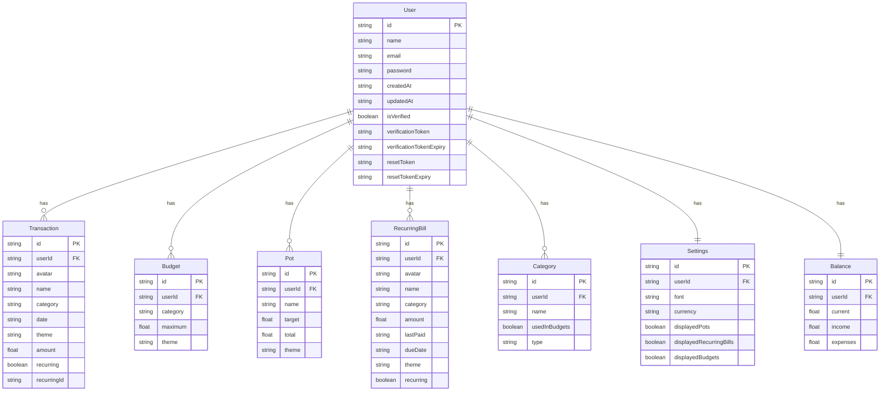

```mermaid
erDiagram
  User ||--o{ Transaction : has
  User ||--o{ Budget : has
  User ||--o{ Pot : has
  User ||--o{ RecurringBill : has
  User ||--o{ Category : has
  User ||--|| Settings : has
  User ||--|| Balance : has

  User {
    string id PK
    string name
    string email
    string password
    string createdAt
    string updatedAt
    boolean isVerified
    string verificationToken
    string verificationTokenExpiry
    string resetToken
    string resetTokenExpiry
  }

  Settings {
    string id PK
    string userId FK
    string font
    string currency
    boolean displayedPots
    boolean displayedRecurringBills
    boolean displayedBudgets
  }

  Balance {
    string id PK
    string userId FK
    float current
    float income
    float expenses
  }

  Transaction {
    string id PK
    string userId FK
    string avatar
    string name
    string category
    string date
    string theme
    float amount
    boolean recurring
    string recurringId
  }

  Budget {
    string id PK
    string userId FK
    string category
    float maximum
    string theme
  }

  Pot {
    string id PK
    string userId FK
    string name
    float target
    float total
    string theme
  }

  RecurringBill {
    string id PK
    string userId FK
    string avatar
    string name
    string category
    float amount
    string lastPaid
    string dueDate
    string theme
    boolean recurring
  }

  Category {
    string id PK
    string userId FK
    string name
    boolean usedInBudgets
    string type
  }
```
